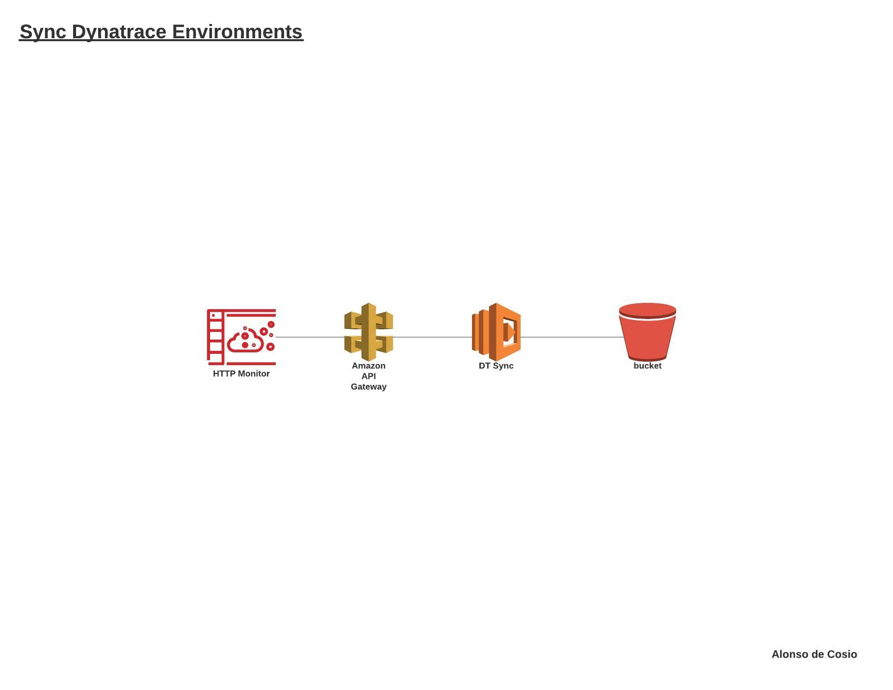

# Automatically synchronize Dynatrace configurations in multiple environments

Sync all the configurations in your Dynatrace environments automatically with a lambda function

## Configurations

1.	Create and configure API Gateway
2.	Create and configure the S3 bucket
3.	Create and configure the Lambda function 
4.	Create and configure synthetic test